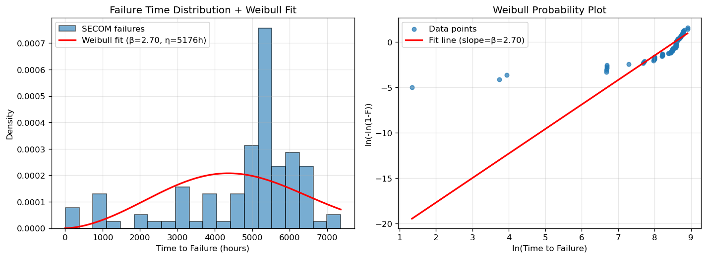
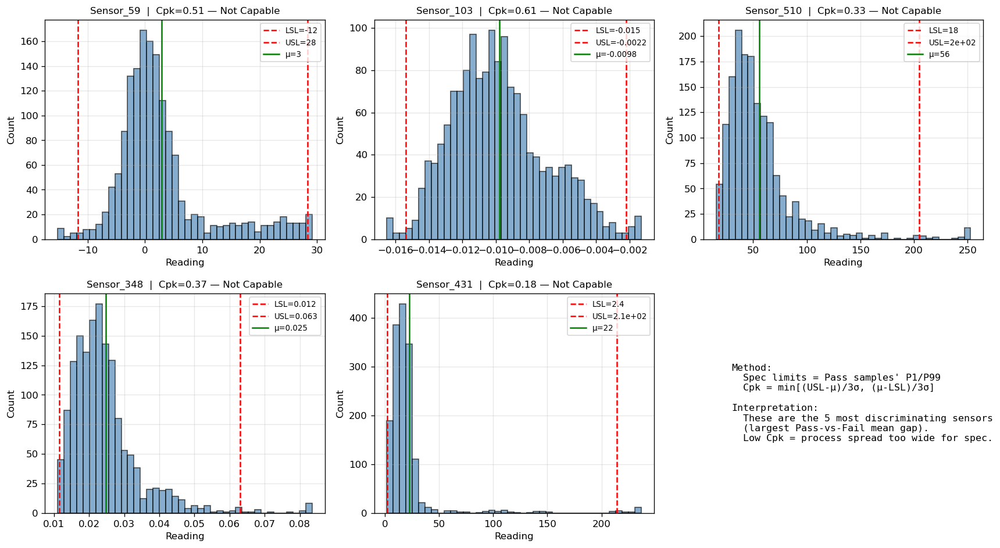

**繁體中文** | [English](README.en.md)

---

# SECOM 良率分析 — 端對端作品集(End-to-End Portfolio)

> 一個建立在 UCI SECOM 資料集(1,567 批晶圓 × 590 感測器,2008-07 ~ 2008-10)上的
> **四層半導體良率分析框架**。本 repo 是**作品集首頁(landing page)**——
> 承載可靠度分析層(Reliability Layer)的程式碼,並連結到儀表板與預測兩個姐妹 repo。

---

## 四層分析框架(The 4-Layer Framework)

同一個良率異常事件(**2008-07 Yield Excursion:良率由 93.4% 陡降至 85.96%**),
透過四層由淺入深的分析視角來檢視——這正是**真實 fab 可靠度工程師**會用的分析順序:

```
┌──────────────────┐    ┌──────────────────┐    ┌──────────────────┐    ┌──────────────────┐
│  Layer 1         │───▶│  Layer 2         │───▶│  Layer 3         │───▶│  Layer 4         │
│  儀表板          │    │  Weibull 分析    │    │  Cpk 製程能力    │    │  FMEA + 8D       │
│  Dashboard       │    │                  │    │                  │    │                  │
│  問題在哪裡?    │    │  怎麼壞的?      │    │  什麼在推它壞?  │    │  為什麼壞?怎麼   │
│  (WHERE)         │    │  (HOW)           │    │  (WHAT)          │    │  修?(WHY + FIX) │
└──────────────────┘    └──────────────────┘    └──────────────────┘    └──────────────────┘
        │                        │                        │                        │
        ▼                        ▼                        ▼                        ▼
  月度良率趨勢圖         β = 2.70                5 個關鍵 sensor         RPN 排序的改善行動
  定位出 2008-07         磨耗型失效              Cpk 0.18 ~ 0.61        + 5-Why + Fishbone
  Yield Excursion        (非隨機)                全部 Not Capable
```

**每一層都能獨立成立**——但**四層串接**(獨立分析在同一根因上收斂)才展現端對端的工程思維。

---

## 逐層拆解(Layer-by-Layer)

### Layer 1 · Dashboard(儀表板)— 良率趨勢 + 感測器健康

**姐妹 Repo**: [semicon-yield-dashboard](https://github.com/tzuhua0308/semicon-yield-dashboard)

PostgreSQL 16 + Streamlit + Plotly。在 92 萬筆感測器讀值上建置 3 tab 儀表板:
月度良率趨勢、感測器健康度(NULL 分析)、批號級鑽取查詢。

**關鍵發現**:2008-07 月度良率跌到 **85.96%**(基線 93.4%)——這是整個作品集所調查的**錨點事件**。

**技術**: PostgreSQL、psycopg2、pandas ETL、Streamlit、Plotly、Tableau Public

---

### Layer 2 · Prediction(預測模型)— 不平衡分類

**姐妹 Repo**: [semicon-yield-prediction](https://github.com/tzuhua0308/semicon-yield-prediction)

在 93.4% 不平衡資料上,從 XGBoost baseline 演進到改良版分類器。
展示「多數類陷阱(Majority Class Trap)」現象(baseline F1 = 0.00)
以及調校路徑,最終 **5-fold OOF F1 = 0.26**。

**技術手法**: VarianceThreshold、Mutual Information Top-50 特徵選擇、
`scale_pos_weight`、OOF threshold tuning(0.5 → 0.12)

**技術棧**: XGBoost、scikit-learn、cross-validation

---

### Layer 3 · Reliability(可靠度)— Weibull + Cpk(本 repo)

針對 2008-07 失效事件的完整可靠度工程分析。

#### Weibull 分佈擬合(Weibull Distribution Fitting)

```
β (shape)  =  2.702    → 磨耗型失效(Wear-out,非隨機)
η (scale)  = 5175.8 hr → 特徵壽命(63.2% 失效點)
B10 life   = 2250.2 hr → 10% 失效時間(常用保固基準)
MTTF       = 4602.8 hr → 平均失效時間
```



右圖 Weibull probability plot 上,失效點呈**線性排列** → 支持 Weibull 假設。
β = 2.70 從數學上證明失效**是時間累積型**,不是隨機事件。

#### Cpk 製程能力分析(Process Capability)

用 **Cohen's d 效果量**從 590 個 sensor 中挑出 Top-5「Pass vs Fail 分佈差距最大」的關鍵變數,
以 Pass 樣本的 P1/P99 作為隱含 spec limits,計算 Cpk:

| Sensor | Cpk  | 判定           |
|--------|------|----------------|
| S_431  | 0.18 | Not Capable    |
| S_510  | 0.33 | Not Capable    |
| S_348  | 0.37 | Not Capable    |
| S_59   | 0.51 | Not Capable    |
| S_103  | 0.61 | Not Capable    |



**判讀**:5 個關鍵 sensor 全部低於業界標準(Cpk ≥ 1.33)——
量化證明**哪些製程參數需要改善**。

---

### Layer 4 · FMEA + 8D — 結構化根因分析(RCA)

完整報告: **[`docs/FMEA_and_8D_Report.md`](docs/FMEA_and_8D_Report.md)**

包含:
- **FMEA 表格**(依 AIAG 4th Ed. 評分: S × O × D = RPN)
- **8D 報告**(D1 團隊組成 → D8 團隊表揚)
- 針對最高 RPN 失效模式的 **5-Why 分析**
- **Fishbone / Ishikawa 魚骨圖**(ASCII 版)
- **對策計畫**(Owner / Deadline / Success Metric)
- **驗證方法**(Cpk 目標、Weibull β 收斂、月良率 ≥ 93.4%)

---

## 專案結構(Project Structure)

```
secom-yield-analytics/  (本 repo — 可靠度分析程式碼 + 作品集首頁)
├── README.md                    ← 你現在看的這頁
├── README.en.md                 ← English version
├── weibull_analysis.py          ← Layer 3a
├── cpk_analysis.py              ← Layer 3b
├── docs/
│   └── FMEA_and_8D_Report.md    ← Layer 4
└── outputs/
    ├── weibull_analysis.png
    └── cpk_analysis.png

姐妹 repo:
├── semicon-yield-dashboard      ← Layer 1
└── semicon-yield-prediction     ← Layer 2
```

---

## 執行方式(How to Run)— Reliability 層

需要姐妹 Dashboard 專案的 SECOM 資料(`../dashboard/data/uci-secom.csv`)。

```bash
# 啟用共用 venv
source ../dashboard/.venv/bin/activate

# Weibull 分析
python weibull_analysis.py

# Cpk 分析
python cpk_analysis.py
```

---

## 設計決策(Design Decisions Worth Explaining)

面試時值得說明的非顯而易見選擇:

| 決策 | 理由 |
|-----|------|
| **2-parameter Weibull(`floc=0`)** | 業界標準做法;3-parameter 版本在小樣本(n=104)上容易過擬合 |
| **失效時間 = 從第一筆觀測開始的小時數** | SECOM 是離散時間生產紀錄,不是壽命測試。此框架是連結到標準 Weibull renewal 分析的橋樑 |
| **Bernard's approximation 中位數秩 `(i - 0.3) / (n + 0.4)`** | 小樣本繪圖標準做法;比 `i / (n+1)` 在 n < 50 時偏差較小 |
| **用 Cohen's d 挑 sensor** | 效果量排序對於 14:1 類別不平衡的 SECOM 較穩健 |
| **隱含 spec limits = Pass 樣本的 P1 / P99** | SECOM 沒有工程規格,用 Pass 分佈當隱含容忍是可辯護的代理值 |
| **AIAG 4th Ed. FMEA 評分** | 廣泛用於汽車與半導體供應鏈,比 fab 內部評分更具可攜性 |

---

## 資料透明度與限制(Limitations & Honesty)

- **Sensor 意義在 UCI SECOM 已匿名化**。FMEA 文件中用 sensor ID 作為物理參數的代理,
  **假設性的失效機制皆明確標註為假設**,而非診斷結論。
- **失效樣本數小**(n = 104)——Weibull β 的 90% 信賴區間約為 ±0.4。
- 本專案是**分析框架的作品集示範**,非可上線的事故報告。

---

## 展示的技能(Skills Demonstrated — Portfolio-Wide)

**資料工程(Data Engineering)**: PostgreSQL 16(long-format schema、views、indexes)、pandas ETL、SQL

**機器學習(Machine Learning)**: XGBoost、imbalanced classification、cross-validation、threshold tuning、feature selection(VarianceThreshold、Mutual Information)

**統計與可靠度(Statistics & Reliability)**: Weibull distribution、Cp/Cpk process capability、Cohen's d、Median Rank、probability plots

**可靠度工程框架(Reliability Frameworks)**: FMEA(AIAG 4th Ed.)、8D Report、5-Why、Fishbone/Ishikawa、RPN、DMAIC、SPC

**視覺化(Visualization)**: Streamlit + Plotly 互動儀表板、matplotlib 靜態圖、Tableau Public

**業界標準參照**: AIAG SPC、AIAG FMEA 4th Ed.、JEDEC JESD22

---

## 相關專案(Related Projects)

- **[semicon-defect-cnn](https://github.com/tzuhua0308/semicon-defect-cnn)** — WM-811K 晶圓缺陷 CNN 分類。電腦視覺姐妹主線(影像資料 / 深度學習),與本 SECOM 表格式 / 統計為主的作品集互補。
